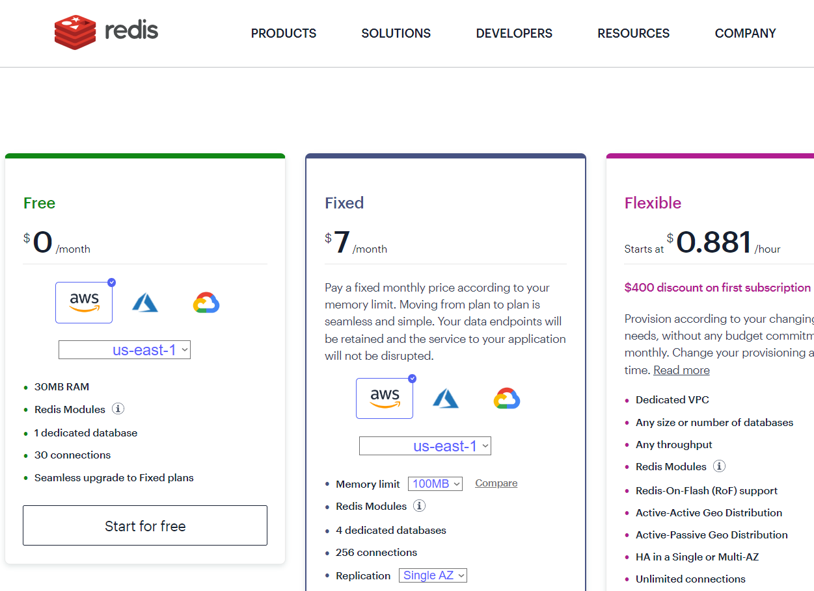
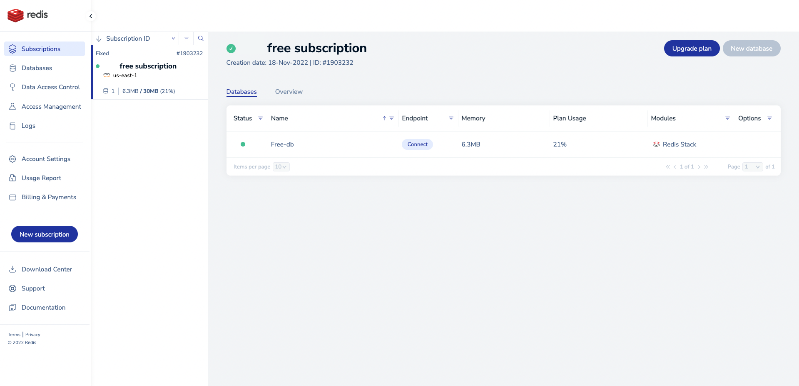
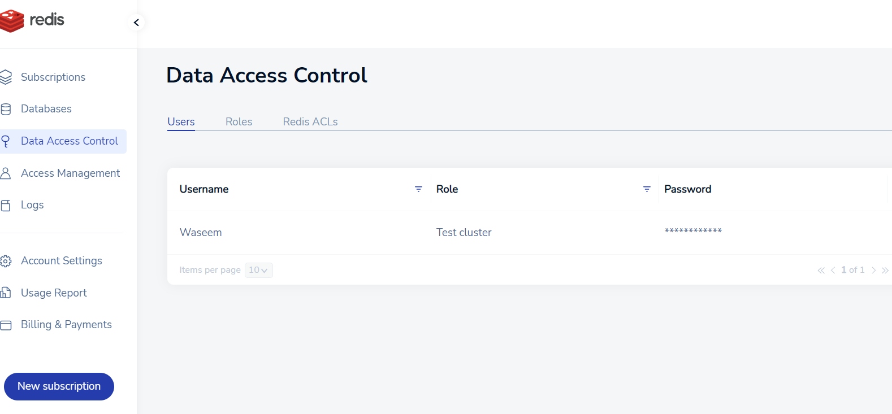
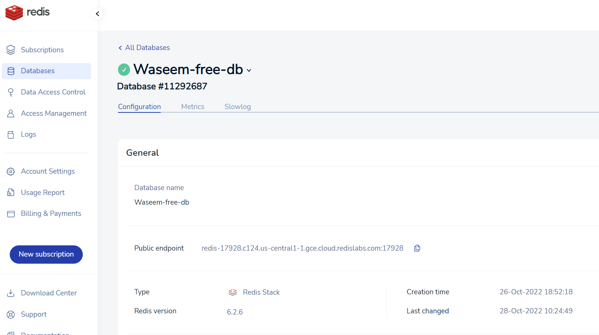
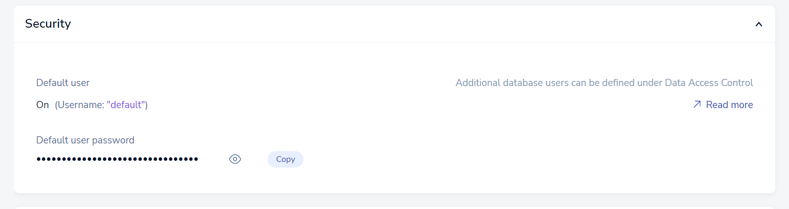
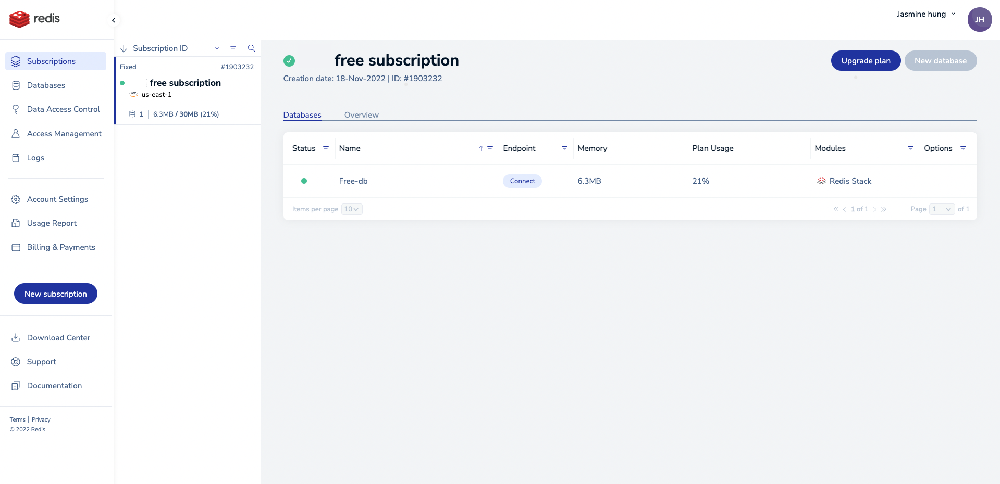
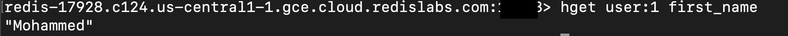

# COSC 516 - Cloud Databases<br/>Lab 7 - Redis

## Setup


Create a Redis **No credit card required** free account at: https://redis.com/redis-enterprise-cloud/pricing/.
Here is a [tutorial](https://developer.redis.com/create/rediscloud/). 

Use any of the providers that appeals to you.


Click on Start for Free. It will redirect you to an account page if you have not already signed up.

Login to Redis and you will see the following. 


## Create a Redis cluster
...


## Configuration

Once your database is created, you can create a new user in the access control section, from the pane on the right. 
Give them a username and password. This can be used in your code to connect to the database.



Or alternatively you can click on "Databases", click on your created database and navigate to the following screen.



Note the public endpoint provided. You will need it to access the database cluster.

Scroll further down and you will find the default user. Using this, you can directly input the password into the redis-cli with the `-a` flag.




## Connect to Redis


The lab will use the Python client library
Use `pip install redis` and/or `pip install redis[hiredis]`. For more details, consult https://github.com/redis/redis-py

You will also need pytest to run the tests.

### Accessing using redis CLI. 

Connect to Redis database can be done with ```redis-cli``` 

The Redis CLI is the command-line interface is a terminal program used to check the database status and test your query. 

You can connect to the redis with the command in your terminal ```redis-cli -p XXXX -h redis-XXX.XXXX.region.provider -a <default-account-password>```. You can also use your own user's authentication details.


To install Redis-cli follow the [instructions](https://redis.io/docs/getting-started/installation/install-redis-on-mac-os/). 
The installation of redis will include the redis-cli with other such as redis-benchmark, redis-server and so on.

The redis connection command can be obtained by clicking the ```connect``` in the homepage of redis.


Once you see ```redis-cli -p XXXX -h redis-XXX.XXXX.region.provider:17928> ```, you can start working with the redis-cli.

Here is one simple example of how to test your query in redis-cli:




### Some reference material. Check it out, it will help you.
- [How Redis incrementally iterate over a collection of elements.](https://redis.io/commands/scan/).
- [Query and Full-text search in Redis](https://www.youtube.com/watch?v=infTV4ifNZY).
- [Redis search using python](https://www.youtube.com/watch?v=UhnEyMDWuyI).
- [In case you create too many index and cause error, you need to delete some of them with the query in redis-cli](https://redis.io/commands/ft.dropindex/).
- [How to unit test the python with VScode](https://www.youtube.com/watch?v=ucjRpS7WCPA).

## Tasks

To test your database, write Python code using VS Code. The file to edit is `redislab.py`.  The test file is `test_redislab.py`.  Fill in the methods requested (search for **TODO**).  Marks for each method are below.  You receive the marks if you pass the pytest tests AND have followed the requirements asked in the question (including documentation and proper formatting).

- +1 mark - Write the method `connect()` to create a connection to Redis. 
- +5 marks - Write the methods `load_users()` and `load_scores()` to load the data into the redis db. Use appropriate data structures.
- +2 marks - Write the method `query1()` that returns all the attribute of the user by usr. 
- +2 marks - Write the method `query2()` that  the coordinate (longitude and latitude) of the user by the usr.
- +4 marks - Write the method `query3()` that get the keys and last names of the users whose ids do not start with an odd number.
- +3 marks - Write the method `query4()` that returns the female in China or Russia with the latitude between 40 and 46.
- +3 marks = Write the method `query5()` that gets the email ids of the top 10 players(in terms of score) in leaderboard:2.

**Total Marks: 20**

## Bonus Marks: (up to 2)

Up to +2 bonus marks for demonstrating some other feature of RediSearch

## Submission

The lab can be marked immediately by the professor or TA by showing the output of the JUnit tests and by a quick code review.  Otherwise, submit the URL of your GitHub repository on Canvas. **Make sure to commit and push your updates to GitHub.**
